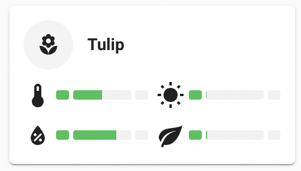
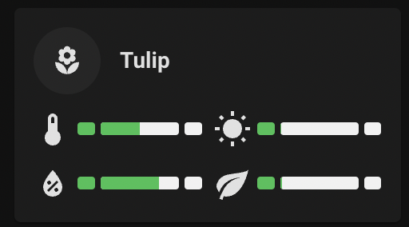

# Plant card




## Description

A flower card to display a plant entity. Also supports additional data from the [patched plant](https://github.com/Olen/homeassistant-plant) component.

## Configuration variables

All the options are available in the lovelace editor but you can use `yaml` if you want.

| Name                      | Type    | Default     | Description                                                               |
| :------------------------ | :------ | :---------- | :------------------------------------------------------------------------ |
| `entity`                  | string  | Required    | Plant entity                                                               |
| `icon`                    | string  | Optional    | Custom icon                                                               |
| `name`                    | string  | Optional    | Custom name                                                               |
| `use_entity_picture`      | boolean | Optional    | Use entity image                                                          |
| `layout`                  | string  | Optional    | Layout of the card. Vertical, horizontal and default layout are supported |
| `hide_state`              | boolean | `false`     | Hide the entity state                                                     |
| `tap_action`              | action  | `toggle`    | Home assistant action to perform on tap                                   |
| `hold_action`             | action  | `more-info` | Home assistant action to perform on hold                                  |
| `double_tap_action`       | action  | `more-info` | Home assistant action to perform on double_tap                            |

### Entity Image

By default, the entity image will pull from Plantbook if you are using the [patched plant](https://github.com/Olen/homeassistant-plant) component.

If you are not using the patched component, and still wish to use an entity image, you will need to add this to the 
customize section of your `configuration.yaml`, as the `plant` integration does not support this by default

```yaml
homeassistant:
    customize:
      plant.tulip:
        entity_picture: "/local/mushrooms.jpeg"
```

As the default `plant` integration does not expose the min/max parameters set in the `plant` entity. Therefore, the below 
values are what the Plant Card will use by default:

| Parameter                      | Value    |
| :------------------------      | :------  |
| `min_temperature`              | 5        |
| `max_temperature`              | 35       |
| `min_moisture`                 | 20       |
| `max_moisture`                 | 60       |
| `min_conductivity`             | 500      |
| `max_conductivity`             | 3000     |
| `min_brightness`               | 2500     |
| `min_brightness`               | 30000    |

If you wish to over-ride these, you will need to add them to the customize section of your `configuration.yaml`:

```yaml
homeassistant:
  customize:
    plant.tulip:
      limits:
        max_brightness: 60000
        max_conductivity: 2000
        max_moisture: 75
        max_temperature: 35
        min_brightness: 3000
        min_conductivity: 425
        min_moisture: 16
        min_temperature: 8
```
